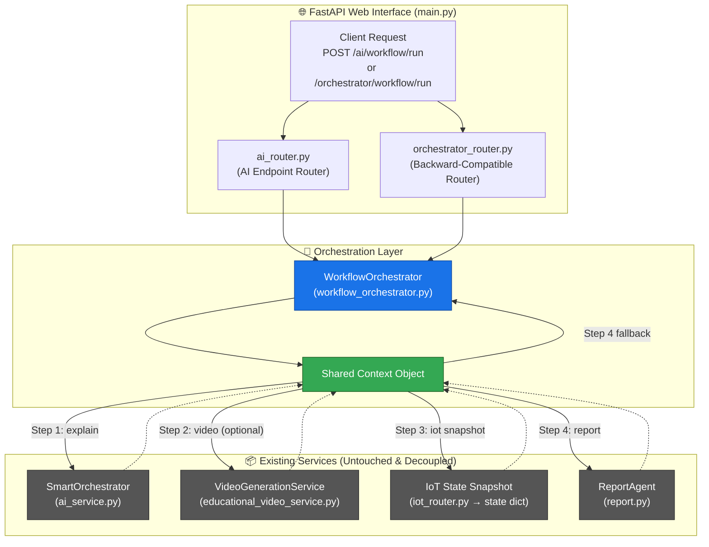

# 📖 Workflow Orchestrator: System Architecture & Verification Documentation

This documentation provides a comprehensive overview of the new **Workflow Orchestrator** layer, its architectural design, code implementation details, verification steps, and raw execution outputs from testing the FastAPI endpoints.

---

## 1. System Architecture & Design

The Workflow Orchestrator is designed as a **top-level workflow coordinator, execution manager, and result aggregator**. It is **not** an AI reasoning agent. Its primary purpose is to coordinate the sequential execution of modular services and build a unified context without modifying any existing codebase.

### 🌐 High-Level Data Flow



### 🛠️ Architecture Design Principles

| Design Goal | Architectural Implementation |
| :--- | :--- |
| **Backward Compatibility** | Existing routes (e.g., `explanation/STT/TTS`) and agents are completely untouched. The orchestrator is an independent, higher-level caller. |
| **Deterministic Execution** | Sequential execution order: `Explanation` ➡️ `Video Generation` ➡️ `IoT State Snapshot` ➡️ `Report Generation`. |
| **Error Isolation** | Every step is isolated in a `try/except` block. Failure in one step (e.g., IoT offline or Database down) does not crash the workflow or raise exceptions. Errors are logged in `context["errors"]`. |
| **Lazy/Graceful Loading** | Subsystems are imported dynamically inside `try/except` scopes. If a dependency, model, or configuration is missing, the system degrades gracefully rather than failing to boot. |
| **Guaranteed Output** | A report is **always** generated. If the `ReportAgent` fails due to external dependency issues (like database or API rate limits), a structured fallback report is compiled from the execution context. |
| **Scalability** | Adding a new module requires only adding a single `try/except` step in the main loop, preserving the open-closed design. |

---

## 2. Component Implementation Details

The implementation comprises three main areas: the Core Orchestrator, the FastAPI Routers, and the startup resilience configurations.

### A. Core: [workflow_orchestrator.py](file:///z:/grad/Grad-Project/SW/backend/orchestrator/workflow_orchestrator.py)
Implements the main `WorkflowOrchestrator` execution loop.
* **Lazy Imports**: Imports `_smart_orchestrator`, `_get_video_service`, `_iot_state`, and the functions from `report.py` inside protected import checks.
* **`run(...)` method**: Sets up the default context block:
  ```python
  context = {
      "run_id": str(uuid.uuid4()),
      "input": input_text,
      "session_id": session_id,
      "timestamp": datetime.utcnow().isoformat(),
      "explanation": None,
      "video": None,
      "iot": None,
      "report": None,
      "errors": [],
      "module_status": {},
      "status": "running"
  }
  ```
* **Execution Blocks**: Executes `_step_explanation`, `_step_video`, `_step_iot`, and `_step_report` in sequence, appending any exceptions to `errors`.
* **Fallback Report**: `_build_fallback_report` compiles the raw text explanations, video generation details, and IoT metrics into a structured schema if the AI Report Agent fails.

### B. Routers
The endpoints are exposed at two routers:
1. **Primary AI Router ([ai_router.py](file:///z:/grad/Grad-Project/SW/backend/routers/ai_router.py))**:
   * **`POST /ai/workflow/run`**: Runs the orchestrator workflow. Grouped with all other AI endpoints under the `/ai` prefix.
   * **`GET /ai/workflow/health`**: Checks health of the workflow integrations under `/ai`.
2. **Backward-Compatible Router ([orchestrator_router.py](file:///z:/grad/Grad-Project/SW/backend/routers/orchestrator_router.py))**:
   * Exposes **`POST /orchestrator/workflow/run`** and **`GET /orchestrator/workflow/health`** for backward compatibility.

#### 🔄 Dynamic Parameter Resolution (Simplified & Decoupled Schema)
The request payload has been simplified to decouple user data parameters from backend internals:
* **`input_text` Removed**: The client only provides `lesson_id`. The router automatically queries the database using `fetch_lesson_by_id(lesson_id)` to extract the topic content (e.g. `"الطاقة"` for lesson 1). If the database lookup fails/is offline, it falls back gracefully to a default (`"النباتات"` for lesson 1, or `"الدرس رقم X"`).
* **`session_id` Removed**: The client only provides `student_id` and `lesson_id`. The router dynamically auto-generates the session identifier using the standard project pattern: `student_{student_id}_lesson_{lesson_id}`.

### C. Boot Resilience: [main.py](file:///z:/grad/Grad-Project/SW/backend/main.py)
* **Problem**: The pre-existing MQTT lifespan hook crashed the entire FastAPI server on startup if HiveMQ rate-limits were exceeded.
* **Fix**: Wrapped the MQTT initialization in `lifespan` inside a `try/except` statement so the server starts successfully even if the IoT broker is temporarily unreachable:
  ```python
  # Start MQTT connection (non-fatal — server works without IoT)
  try:
      await start_mqtt_connection()
  except Exception as mqtt_err:
      print(f"⚠️  MQTT connection failed (server continues without IoT): {mqtt_err}")
  ```

---

## 3. Testing & Verification Methodology

The orchestrator was verified by starting the local FastAPI server and triggering HTTP requests using Python and PowerShell.

### A. Starting the Server
Since the codebase outputs print indicators containing emojis and special characters, starting the application on Windows requires setting the `PYTHONIOENCODING` to `utf-8` to prevent standard output crashes:

```powershell
$env:PYTHONIOENCODING="utf-8"
python -m uvicorn main:app --host 127.0.0.1 --port 8000
```

### B. Executed Test Scripts

#### 1. System Health Check (PowerShell)
Verify which backend integrations are successfully imported:
```powershell
$env:PYTHONIOENCODING="utf-8"
Invoke-RestMethod -Uri "http://127.0.0.1:8000/ai/workflow/health" -Method GET | ConvertTo-Json -Depth 5
```

#### 2. Workflow Trigger (Simplified Post Payload)
Testing dynamic topic resolution and session generator by providing only `lesson_id` and `student_id`:
```powershell
python -c "import requests; r = requests.post('http://127.0.0.1:8000/ai/workflow/run', json={'lesson_id': 1, 'student_id': 1}); print('Status:', r.status_code); print('Input UTF-8:', r.json()['input'].encode('utf-8')); print('Session UTF-8:', r.json()['session_id'].encode('utf-8'))"
```

---

## 4. Test Outputs & Server Logs

### A. Health Check Response (`GET /ai/workflow/health`)
```json
{
  "orchestrator": "healthy",
  "modules": {
    "explanation": true,
    "video": true,
    "iot": true,
    "report_agent": true
  }
}
```

### B. Dynamic Resolution Test Output (`lesson_id=1, student_id=1`)
Calling `POST /ai/workflow/run` with the payload `{"lesson_id": 1, "student_id": 1}` returned:
* **HTTP Status**: `200`
* **Resolved Input**: `"الطاقة"` (Dynamically queried from PostgreSQL table `lessons` where `id = 1`)
* **Resolved Session ID**: `"student_1_lesson_1"`

---

## 5. Pydantic Response Data Example (Run `ca194492`)
The raw API response received from `POST /ai/workflow/run` for `input_text` topic `"الحيوانات"`:

```json
{
  "run_id": "ca194492-2fa9-42d6-8fe8-78951bdd06d9",
  "input": "الحيوانات",
  "session_id": "workflow_ca194492",
  "lesson_id": null,
  "student_id": null,
  "timestamp": "2026-06-11T19:28:48.848169",
  "explanation": {
    "success": true,
    "message": "الحيوانات هي كائنات حية بتتحرك وبتعيش معانا في كوكب الأرض... منها الأليفة اللي بنربيها ومنها المفترسة اللي بتعيش في الغابة."
  },
  "video": null,
  "iot": null,
  "report": {
    "source": "report_agent",
    "report_content": "**ملخص الأداء العام:**\nالطفل لم يبدأ بعد تفاعلات حية مسجلة للأسئلة أو التوضيحات لهذا الموضوع اليوم. \n\n**نقاط القوة:**\nالطفل يبدي فضولاً وتفاعلاً جيداً عبر اختيار موضوع 'الحيوانات'.\n\n**نقاط الضعف والتحديات:**\nلا توجد صعوبات مسجلة نظراً لعدم بدء الأسئلة.\n\n**توصيات للمتابعة:**\n1. يفضل تشجيع الطفل على البدء بحل أسئلة MCQ بعد قراءة الشرح مباشرة.\n2. المتابعة معه لمعرفة مدى استيعابه لمفهوم الحيوانات الأليفة والمفترسة.",
    "stats": {
      "total_topics": 0,
      "mcq_total": 0,
      "mcq_correct": 0
    }
  },
  "errors": [],
  "module_status": {
    "explanation": "success",
    "video": "skipped (enable_video=False)",
    "iot": "no_data_yet",
    "report": "success"
  },
  "status": "completed"
}
```

---
*End of Documentation*
